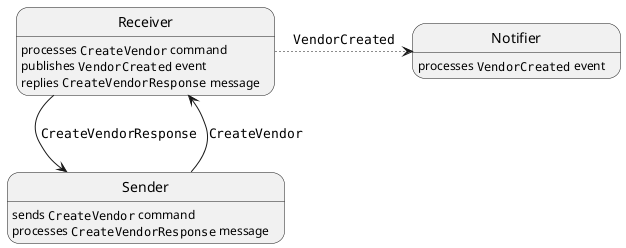
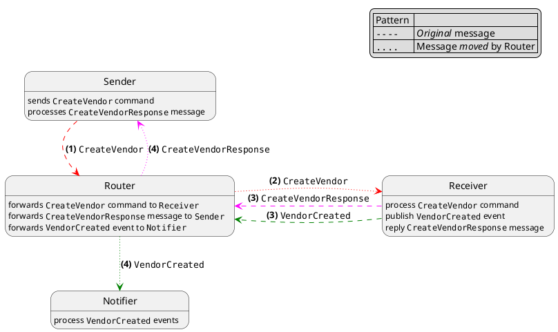
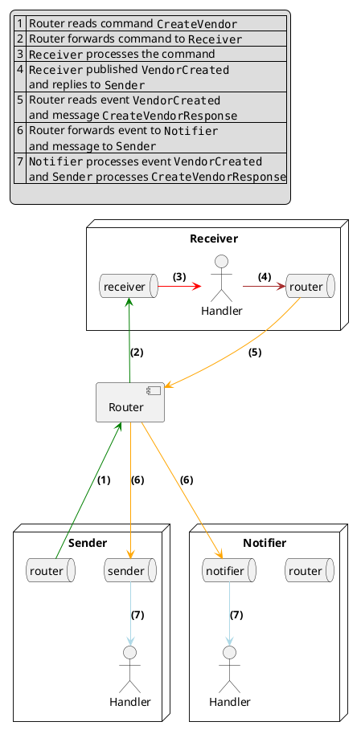

# Sample project to play with NServiceBus.Router

## Components of the system

| Endpoint                        | Notes                                      |
|---------------------------------|--------------------------------------------|
| `NsbBridgePlayground.Sender`    |                                            |
| `NsbBridgePlayground.Receiver`  |                                            |
| `NsbBridgePlayground.Notifier`  |                                            |
| `NsbBridgePlayground.Router`    |                                            |
| `NsbBridgePlayground.Common`    | Messages and infrastructure components     |
| `NsbBridgePlayground.Bootstrap` | Component to configure and start endpoints |

## Behavior

### Without the routrer



### Using the router



### How it works

These are relevant table in each database

| Database                       | Table                  | Used for                                                                                                     |
|--------------------------------|------------------------|--------------------------------------------------------------------------------------------------------------|
| `NsbRouterPlayground.Sender`   | `Sender`               | Input queue for `Sender`; receives messages for `Sender`, i.e. replies, subscription requests, ...           |
|                                | `SubscriptionRouting`  | Subscription data when native pub/sub is supported (`NserviceBus.SqlServer` v5.0 or later)                   |
|                                | `Router`               | Input queue for router; stores messages to be forwarded to other parts of the system                         |
| `NsbRouterPlayground.Receiver` | `Receiver`             | Input queue for `Receiver`; receives messages (forwarded by router), e.g. commands `Receiver` should process |
|                                | `SubscriptionRouting`  | Subscription data when native pub/sub is supported (`NserviceBus.SqlServer` v5.0 or later)                   |
|                                | `Router`               | Input queue for router; stores messages to be forwarded to other parts of the system                         |
| `NsbRouterPlayground.Notifier` | `Notifier`             | Input queue for `Notifier`; receives messages (forwarded by router) for `Notifier`, e.g. events              |
|                                | `SubscriptionRouting`  | Subscription data when native pub/sub is supported (`NserviceBus.SqlServer` v5.0 or later)                   |
|                                | `Router`               | Input queue for router; stores messages to be forwarded to other parts of the system                         |

> Assuming `NserviceBus.SqlServer` v5 or later is used

> `Router` is added by the router, i.e. it is not created as part of the endpoint initialization, as it happens for other tables for the endpoint (assuming `EndpointConfiguration.EnableInstallers` is called, of course). 

When an endpoint starts:

- it sends subscription requests for events it handles; since the router is being used, subscription requests are queued into the router queue at the subscriber.

- it configure routes to forwards commands to their respective recipient.

  > When `Sender` sends a `CreateVendor` command, the command is queued in `Router` at `Sender`.  

> No setup is required for messages sent via `Reply`: the router handles them transparently without any configuration, using additional metadata added to the message.

When `Recevier` processes a message, it queues two messages into its local `Router` queue:

- Event `VendorCreated`
- Message `CreateVendorResponse`

The router then picks up those messages, and deliver them to their final recipient

- `VendorCreated` is forwarded to endpoint `Notifier`
- `CreateVendorResponse` is forwarded to endpoint `Sender`

## How commands are routed

This is a command as it is initially queued (i.e. stored in `Router` table in `Sender` database)

```json
{
    "NServiceBus.MessageId": "c4af2369-96c1-4bf1-bdcc-b01c00ab68fb",
    "NServiceBus.Bridge.DestinationEndpoint": "Receiver",
    "NServiceBus.MessageIntent": "Send",
    "NServiceBus.ConversationId": "47d99773-6ac2-4fde-ad46-b01c00ab68fc",
    "NServiceBus.CorrelationId": "c4af2369-96c1-4bf1-bdcc-b01c00ab68fb",
    "NServiceBus.ReplyToAddress": "Sender@[nsb]@[NsbRouterPlayground.Sender]",
    "NServiceBus.OriginatingMachine": "UKSWL-1691759",
    "NServiceBus.OriginatingEndpoint": "Sender",
    "$.diagnostics.originating.hostid": "0bb6caccec7325cdbd53d3817375b672",
    "NServiceBus.ContentType": "text\/xml",
    "NServiceBus.EnclosedMessageTypes": "NsbRouterPlayground.Common.Messages.Commands.CreateVendor, NsbRouterPlayground.Common, Version=1.0.0.0, Culture=neutral, PublicKeyToken=null",
    "NServiceBus.Version": "7.8.2",
    "NServiceBus.TimeSent": "2023-06-09 10:24:05:119627 Z"
}
```

We can see the additional header `"NServiceBus.Bridge.DestinationEndpoint": "Receiver"`, which tells the router who the final recipient is.

When the router delivers the message to `Receiver`, we can see headers are slightly different:

```json
{
  "NServiceBus.MessageId": "c4af2369-96c1-4bf1-bdcc-b01c00ab68fb",
  "NServiceBus.Bridge.DestinationEndpoint": "Receiver",
  "NServiceBus.MessageIntent": "Send",
  "NServiceBus.ConversationId": "47d99773-6ac2-4fde-ad46-b01c00ab68fc",
  "NServiceBus.CorrelationId": "iface|6|Sender|reply-to|41|Sender@[nsb]@[NsbRouterPlayground.Sender]|id|36|c4af2369-96c1-4bf1-bdcc-b01c00ab68fb",
  "NServiceBus.ReplyToAddress": "Router@[nsb]@[NsbRouterPlayground.Receiver]",
  "NServiceBus.OriginatingMachine": "UKSWL-1691759",
  "NServiceBus.OriginatingEndpoint": "Sender",
  "$.diagnostics.originating.hostid": "0bb6caccec7325cdbd53d3817375b672",
  "NServiceBus.ContentType": "text\/xml",
  "NServiceBus.EnclosedMessageTypes": "NsbRouterPlayground.Common.Messages.Commands.CreateVendor, NsbRouterPlayground.Common, Version=1.0.0.0, Culture=neutral, PublicKeyToken=null",
  "NServiceBus.Version": "7.8.2",
  "NServiceBus.TimeSent": "2023-06-09 10:24:05:119627 Z",
  "NServiceBus.Router.ReplyTo": "Router",
  "NServiceBus.Bridge.Trace": "via|6|Router"
}
```

As we can see:

- `"NServiceBus.CorrelationId"` has been extended, and some data has been added by the router
- `"NServiceBus.ReplyToAddress"` has been overwritten with the address of the router

