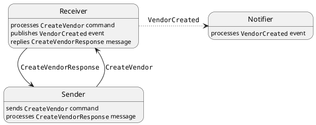
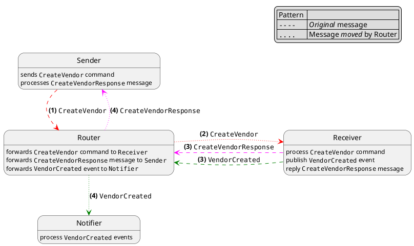

# Sample project to play with NServiceBus.Router

## Components of the system

| Endpoint                        | Notes                                      |
|---------------------------------|--------------------------------------------|
| `NsbBridgePlayground.Sender`    |                                            |
| `NsbBridgePlayground.Receiver`  |                                            |
| `NsbBridgePlayground.Notifier`  |                                            |
| `NsbBridgePlayground.Router`    |                                            |
| `NsbBridgePlayground.Common`    | Messages and infrastructure components     |
| `NsbBridgePlayground.Bootstrap` | Component to configure and start endpoints |

## Behavior

### Without the routrer

### Using the router

### How it works

These are relevant table in each database

| Database                       | Table                  | Used for                                                                                                     |
|--------------------------------|------------------------|--------------------------------------------------------------------------------------------------------------|
| `NsbRouterPlayground.Sender`   | `Sender`               | Input queue for `Sender`; receives messages for `Sender`, i.e. replies, subscription requests, ...           |
|                                | `SubscriptionRouting`  | Subscription data when native pub/sub is supported (`NserviceBus.SqlServer` v5.0 or later)                   |
|                                | `Router`               | Input queue for router; stores messages to be forwarded to other parts of the system                         |
| `NsbRouterPlayground.Receiver` | `Receiver`             | Input queue for `Receiver`; receives messages (forwarded by router), e.g. commands `Receiver` should process |
|                                | `SubscriptionRouting`  | Subscription data when native pub/sub is supported (`NserviceBus.SqlServer` v5.0 or later)                   |
|                                | `Router`               | Input queue for router; stores messages to be forwarded to other parts of the system                         |
| `NsbRouterPlayground.Notifier` | `Notifier`             | Input queue for `Notifier`; receives messages (forwarded by router) for `Notifier`, e.g. events              |
|                                | `SubscriptionRouting`  | Subscription data when native pub/sub is supported (`NserviceBus.SqlServer` v5.0 or later)                   |
|                                | `Router`               | Input queue for router; stores messages to be forwarded to other parts of the system                         |

> Assuming `NserviceBus.SqlServer` v5 or later is used

> `Router` is added by the router, i.e. it is not created as part of the endpoint initialization, as it happens for other tables for the endpoint (assuming `EndpointConfiguration.EnableInstallers` is called, of course). 
