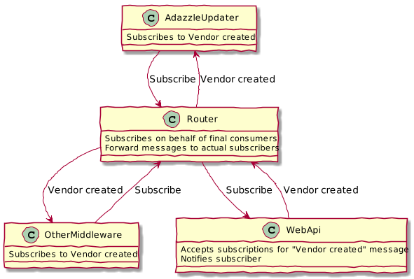

# Sample project to play with NServiceBus.Router

## Structure

Here is a short description of the solution and its projects.

|Project|Description|
|-|-|
|`NsbPlayground.Router`| Router, responsible to connect a Web API application and its subscribers|
|`NsbPlayground.WebApi`| Sample Web API application, publishing a `VendorCreated` event|
|`NsbPlayground.AdazzleUpdater`| Consumes messages |
|`NsbPlayground.Infrastructure.Persistence`| Code related to persistence for business data|
|`NsbPlayground.Core`| Definition of domain types|
|`NsbPlayground.Integration.Messages`| Integration messages|
|`NsbPlayground.Business`| SQL project for business database|
|`NsbPlayground.Nsb`| SQL project for NServiceBus database|

## Overview

A Web API application ("WebApi") processes data and publishes an event (`VendorCreated`).
This application is not aware of any other parts of the system (ir router and subscribers).

A router ("NServiceBusPlayground.Router") is an external service, which is responsible to route messages 
from then publisher and its subscribers. 

A sample consumer ("AdazzleUpdater") processes messages (`VendorCreated` so far).

### Databases

The system is using two databases 
- `NsbRouterPlayground.Business`, which stores business data processed by `WebApi` application 
- `NsbRouterPlayground.Nsb`, which stores data required by NserviceBus (messages and other infrastructure information)

To avoid dependency on MS DTC, and still have a stable system, a few tables related to NServiceBus
are stored in `NsbRouterPlayground.Business` database, ie
- a few tables required by the endpoint hosted in the WebApi application 
- a few tables required by the router
To make the separation explicit, these tables are assigned a different SQL schema than other tables.

### How it works

Web the WebApi application publishes a message, it simply add an entry in `NsbRouterPlayground.Router` table.
These two actions happen in the scope of a (local) transaction, so the result is consistent:
- we cannot have phantom messages, i.e. messages without change being persisted 
- we cannot have changes without messages being sent

As a separate step (and in a separate process, but this is not mandatory), the router picks up 
these messages, and dispatches them. During this process, the router will access the two databases, reading
messages from `NsbRouterPlayground.Business` and forwarding to every subscriber.
Please note final subscribers are not known to the publisher (ie WebApi application).

In details
- Subscribers
  - are aware there is a router, and must be configured properly
  - must know who is publishing a message
  - sends a (service) message to the router to subscribe to an event
- `NsbRouterPlayground.Router`
  - must be configured to connect (ie route messages) between two (or more) different parts of the system
  - receives subscriptions requests from subscribers, and register on their behalf to the publisher; please note that 
    *from the poit of view of the publisher, the router is the subscriber*
  - receives messages from the publisher, and forward them to subscribers according to its subscription data
- `WebApi`
  - receives subscription requests from the router
  - send message to Router 

These are relevant table in each database

|Database|Table|Used for|
|-|-|-|
|`NsbRouterPlayground.Business`|`NsbRouterPlayground.Router`| Input queue for Router, published messages|
| |`WebApi`| Receives subscription requests (from Router)|
| |`WebApi_SubscriptionData`| Stored subscriptions for messages published by WebApi (currenly `VendorCreated`) |
| |`RouterSubscriptionData`| Not used in this case, as this side of the system does not receive messages |
| |`NsbRouterPlayground.Router`| Input queue for router; stores messages to be forwarded to other parts of the system |
|`NsbRouterPlayground.Nsb`|`AdazzleUpdater`| Input queue for AdazzleUpdated; receives events (forwarded by router) AdazzleUpdater is subscribed to|
||`AdazzleUpdater_OutboxData`| Required when Outbox feature, to avoid processing a message more than once |
||`NsbRouterPlayground.Router`| Input queue for Router; receives subscription requests (to be forwarded to publishers) and messages to be forwarded to subscribers|
||`RouterSubscriptionData`| Stores subscription messages Router is receiving on behalf of actual subscribers; used by Router to route received messages to final recipient|

#### Sample flow

- `AdazzleUpdater` starts, and sends a service message to subscribe to `VendorCreated` event.
  - a message is queued in `NsbRouterPlayground.Router` queue
- `NsbRouterPlayground.Router` picks up this message and analyzes it
  - `NsbRouterPlayground.Router` registers `AdazzleUpdater` as a subscriber of `VendorCreated` message
  - since the actual publisher is `WebApi`, `NsbRouterPlayground.Router` register itself as a subscriber, so a message is queued in `WebApi` input queue 
- `WebApi` register `NsbRouterPlayground.Router` as a subscriber
  - an entry is added in `WebApi_SubscriptionData` (if required)

##### When a message is published

- `WebApi` adds an entry to `NsbRouterPlayground.Router` in `NsbRouterPlayground.Business` database
- `NsbRouterPlayground.Router` picks up the message (in `NsbRouterPlayground.Business`) and deliver it to subscribers (currently `AdazzleUpdater` only) 
  in `NsbRouterPlayground.Nsb` database
- `AdazzleUpdater` process the message
  - The ID of the incoming message is checked against entries in `AdazzleUpdater_OutboxData`
    - if no matching item is found, a new entry is added in `AdazzleUpdater_OutboxData` and processed normally
    - if a matching item is found, it means that same message has already been received, then
      - if no pending actions are there (serialized in `AdazzleUpdater_OutboxData.Operations`), the handler simply aknowledge the incoming message and it's done
      - if pending actions are found (e.g. delivering outbound messages)
        - the action of the handler is not executed
        - pending action are executed (and eventually marked as done)
  
Outbox actually provides *exactly-once-delivery* semantics and consistency guarantee between business actions and messages.
Please note: if the state of non-transactional resources is updated as part of the action, that change is then "permanent", even if processing eventually fails; 
for similar scenarios, additional logic should be added (but, again, it may not be enough: in similar cases we can mitigate the problem,
and eventually provide all context information to help sorting out the problem in a more traditional manner).